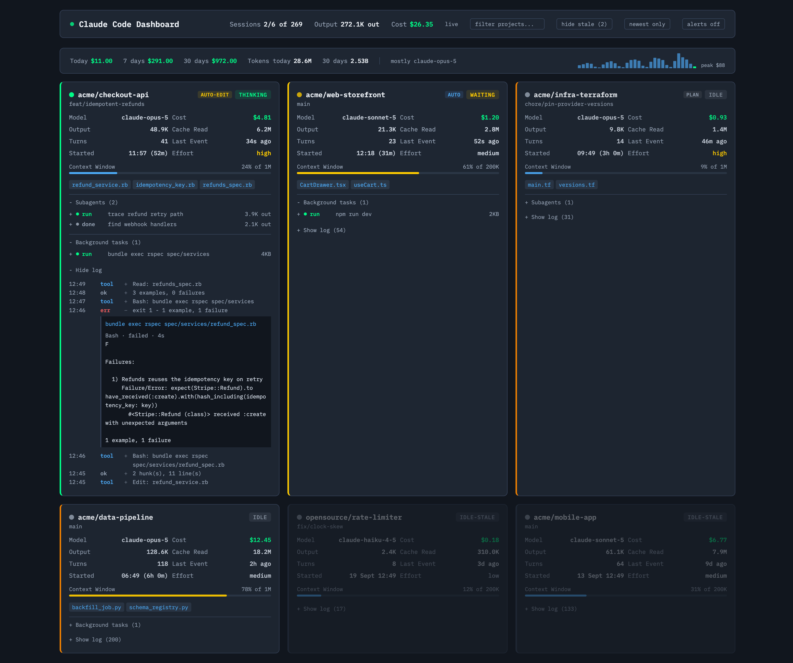

# Claude Code Dashboard

A localhost dashboard that monitors every Claude Code session at once. Spend, tokens,
context usage, status, and activity across all your terminals on one page.



> Fork of [Stargx/claude-code-dashboard](https://github.com/Stargx/claude-code-dashboard)
> with corrected pricing and token accounting, a smaller poll payload, and a usage header.
> See [Changes in this fork](#changes-in-this-fork).

## Why?

Claude Code has no cross-session visibility. Running two or more sessions in separate
terminals means alt-tabbing to check status, no combined token/cost view, and no way to
see which session is active.

## Features

- **Live session monitoring** — auto-detects all Claude Code sessions
- **Usage header** — today / 7-day / 30-day spend, token counts, top model, 30-day sparkline
- **Cost tracking** — per-model rates, with cache writes billed by TTL and cache reads at 0.1x
- **Context window bar** — per session, sized to that session's actual limit
- **Status detection** — thinking (green), waiting (yellow), idle (orange), stale (dimmed)
- **Session start time** — clock time plus elapsed, per card
- **Desktop alerts** — notification and tab-title count when a session waits for you
- **Project filter, hide-stale and show-all-sessions toggles** — all persist across reloads
- **Connection health** — red dot and last-update age if the watcher stops responding
- **Subagents** — every one the session spawned, running or finished. Click a row for the
  full brief it was given and its full report, with the tool-by-tool feed one click away
- **Background tasks** — anything the session pushed to the background. Their output
  never reaches the session log, so it is read from their output files; click a row for
  the tail of it
- **Recently touched files**, per session
- **Expandable log feed**, fetched on demand
- **Click to open** a project folder, **git branch**, **permission mode badges**
- **Cross-platform** — Windows, macOS, and Linux

## Quick Start

```bash
git clone https://github.com/OleksandrPoltavets/claude-code-dashboard.git
cd claude-code-dashboard
npm install
npm start
```

Open **http://localhost:3456**.

Run it in its own terminal tab. Your Claude Code sessions run as normal; the dashboard
watches them from the side.

## Configuration

All optional, all environment variables:

| Variable | Default | What it does |
| --- | --- | --- |
| `PORT` | `3456` | Port to serve on |
| `CONTEXT_WINDOW` | `200000` | Starting context limit per session, in tokens |
| `RETENTION_DAYS` | `30` | Sessions idle longer than this are archived |
| `LOG_KEEP` | `200` | Log lines held per session |
| `TASK_DIR` | `/tmp/claude-<uid>`, or `<temp>/claude` on Windows | Where Claude Code writes background task output |

```bash
PORT=8080 CONTEXT_WINDOW=1000000 npm start
```

### `CONTEXT_WINDOW`

Claude Code does not record a session's context limit in its logs, so the dashboard
infers it. It starts at `CONTEXT_WINDOW` and steps up to 1M once a session is seen
using more than 200K in a single turn — a 200K session compacts before it can.

Set `CONTEXT_WINDOW=1000000` if you run the 1M context tier. Otherwise every session
reads as nearly full until it crosses 200K.

### `RETENTION_DAYS`

Sessions with no activity for this many days are folded into a running total and dropped
from memory. Their spend still counts in the header; they lose their card and their log.
This keeps memory flat on a long-running watcher.

## Reading the header

```
Sessions 0/20 of 115    Output 13.4M out    Cost $2269.13
```

| Number | Meaning |
| --- | --- |
| `0` | Sessions busy right now — thinking or waiting for input |
| `20` | Cards drawn on screen |
| `115` | Every session found in the logs |

Fewer cards than sessions is normal. Each time you open Claude Code in a project you
start a new session, so a project accumulates many. Only the newest per project gets a card.
The `newest only` / `all sessions` button in the header switches between the two views.

The two cost figures cover different windows on purpose: the top row is **all time**,
the usage row's `30 days` is the **last 30 days**.

## How It Works

Claude Code writes JSONL session logs to `~/.claude/projects/`. The dashboard:

1. **Watches** those files with `chokidar`
2. **Parses** appended lines as they stream in, holding back any partial trailing line
3. **Serves** aggregated state over a small Express API
4. **Renders** a page that polls every 2 seconds

No WebSockets, no build step, no cloud services. A Node.js process reading local files.

Token counts are de-duplicated per message id. Claude Code rewrites the same message
repeatedly while streaming, so counting raw events roughly doubles both turns and tokens.

### API

| Endpoint | Returns |
| --- | --- |
| `GET /api/sessions` | `{ sessions, totals, usage, serverTime }` — `?all=1` skips the newest-per-project collapse |
| `GET /api/sessions/:id/log` | Recent log entries for one session |
| `GET /api/sessions/:id/subagents/:agentId` | Summary, report, and step feed for one subagent |
| `GET /api/sessions/:id/tasks/:taskId` | Status, exit code, and output tail for one background task |
| `POST /api/open-folder` | Opens a path in the OS file manager |

Logs are served separately because they were ~75% of every poll. Fetching them only for
expanded cards cut the payload by about 80%. Subagent transcripts are read from
`~/.claude/projects/<hash>/<session>/subagents/agent-<id>.jsonl` on click, for the same reason.

A background task's output is never streamed to the JSONL. The session log records only
that one was started and, later, a `queue-operation` notification that it finished - so
the live output has to come from elsewhere. Claude Code writes it to
`/tmp/claude-<uid>/<hash>/<session>/tasks/<taskId>.output`, and appends
`[exited with code N]` or `[killed]` when one ends. A task with neither marker that has
been silent for ten minutes is shown as `quiet`, not `run`.

A task's name is not in its output file. A Bash task is named from the `description` of
the call that launched it, matched to the task id through the tool result; anything else
is named from the `Background command "x" completed` / `Agent "x" finished` notification
written when it ends. A row with neither - an agent-started task still running, or a
launch whose tool result was too large to keep inline - falls back to the task id.

## Requirements

- **Node.js** v18 or later
- **Claude Code**, any version that writes JSONL session logs

## Pricing

Rates live in `PRICING` in `watcher.js`, in USD per 1M tokens. Update them when Anthropic's
pricing changes:

```js
const PRICING = {
  'claude-opus-5':    { input: 5.00, output: 25.00 },
  'claude-sonnet-5':  { input: 3.00, output: 15.00 },
  'claude-haiku-4-5': { input: 1.00, output:  5.00 },
  // ...
};
```

Cache tokens are multipliers on the base input rate:

| Kind | Multiplier |
| --- | --- |
| Cache write, 5-minute TTL | 1.25x |
| Cache write, 1-hour TTL | 2x |
| Cache read | 0.1x |

Tokens are bucketed per model, so a subagent on a cheaper model does not reprice the
whole session.

Figures are estimates from your local logs at API rates. They are not a bill, and they do
not know about subscription plans or quotas.

## Changes in this fork

**Accuracy**

- 1-hour cache writes were billed at 1.25x; they cost 2x
- Tokens are bucketed per model instead of repriced by whichever model ran last
- Turn counts and subagent tokens no longer double-count streamed message rewrites
- Header totals cover every session, not just the cards on screen
- Context window is per session instead of a hardcoded 200K

**File reader**

- Concurrent reads of the same file are locked out
- A line still being written is held until complete instead of parsed, failed, and skipped
- A truncated or rotated file resets instead of freezing that session
- Lines parse as chunks arrive rather than buffering whole files

**Interface**

- Usage header with spend windows, token counts, top model, and a 30-day sparkline
- Session start time, project filter, hide-stale toggle, desktop alerts
- Show-all-sessions toggle for the older sessions a project accumulates
- Log feed holds 200 lines instead of 30, in a taller scroll box
- Connection health indicator
- Raised text contrast; stale cards keep their fade but clear on hover
- Subagent rows survive the agent finishing, labelled `run` / `done` by word and by colour,
  and open to the agent's full report; step feed collapsed unless the agent is still running

**Subagents**

- Finished subagents stayed in memory but were filtered out of the API, so a session usually
  showed none
- The report was capped at 400 characters; it is now served whole from the transcript
- A subagent transcript lives one directory deeper than a session log, so its events set the
  session's project label to `subagents`

## Tech Stack

- **Backend**: Node.js, Express, chokidar
- **Frontend**: single HTML file, React via CDN, no build step
- **Styling**: dark terminal aesthetic, IBM Plex Mono
- **Dependencies**: 2 production packages (`express`, `chokidar`)

## License

MIT. Original work by Cold Beam Games.
